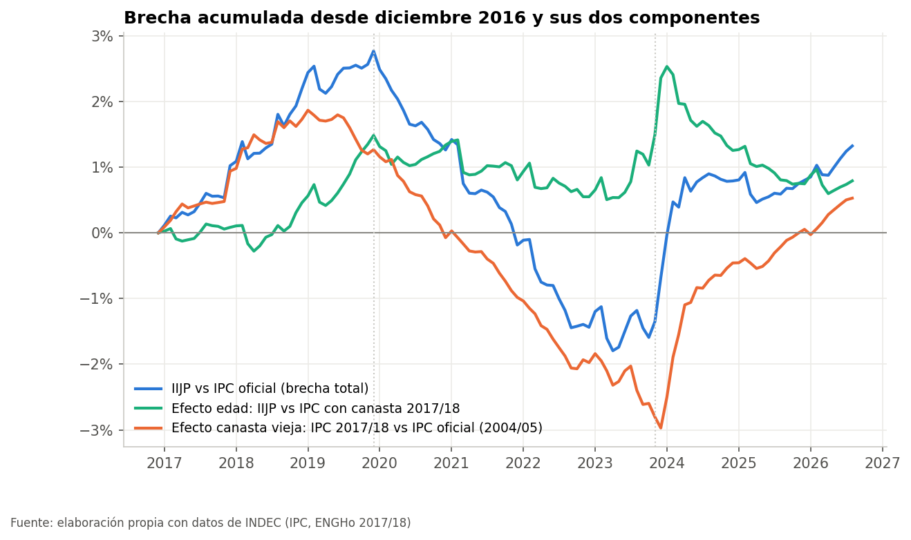
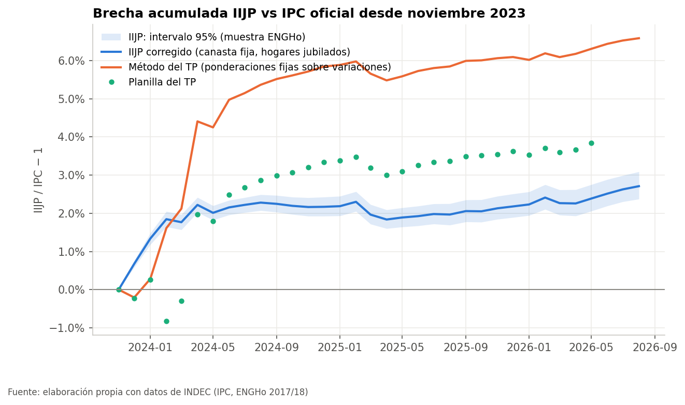
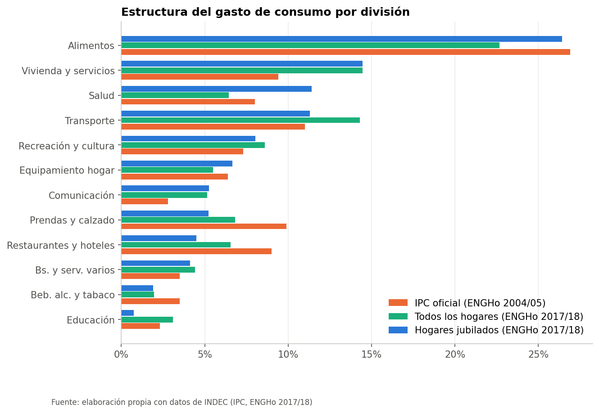
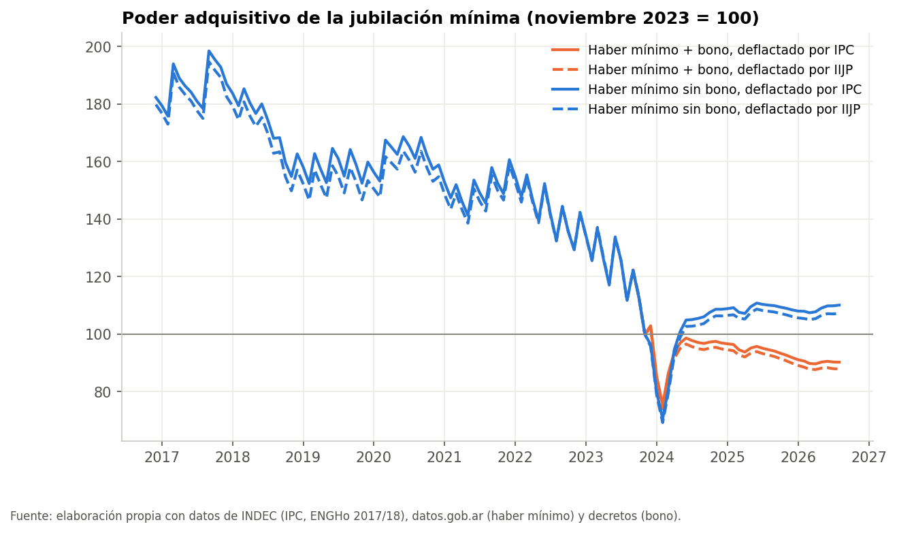

# IIJP · Índice de Inflación de Jubilados y Pensionados

¿La inflación que enfrentan los jubilados es distinta de la que mide el IPC? Este repo construye un
índice de precios con la canasta de consumo de los **hogares jubilados** (microdatos de la ENGHo
2017/18 del INDEC), lo compara con el IPC oficial desde diciembre 2016 y mide qué implicaría usarlo
para actualizar los haberes.

Parte del trabajo práctico de un grupo de la materia *Medición de la coyuntura y estructuras
económicas* (INECO · UADE). Se conservó la pregunta y la canasta, y se corrigieron el método de
cálculo, la comparación con el IPC y los ejercicios de haberes e impacto fiscal. La revisión
detallada del TP original está en [`docs/revision_TP.md`](docs/revision_TP.md).

## Resultados (datos hasta agosto 2026)

| | IPC oficial | IIJP | Brecha |
|---|---|---|---|
| Dic-2016 → ago-2026 | 12.177% | 12.339% | **+1,3%** |
| Macri (dic-16 → dic-19) | 183,4% | 191,3% | +2,8% |
| Fernández (dic-19 → nov-23) | 893,5% | 853,7% | −4,0% |
| Milei (nov-23 → ago-26) | 336,0% | 347,8% | +2,7% |
| Desde 2025 (dic-24 → ago-26) | 59,6% | 60,4% | +0,5% |

1. **La canasta de los jubilados es distinta**: más alimentos (26,4% vs 22,7% del total de hogares) y
   salud (11,4% vs 6,4%); menos educación, transporte, ropa y restaurantes.
2. **La brecha con el IPC no es sistemática**: cambia de signo según el período y en 2016-2026 la
   diferencia media mensual no es distinta de cero (IC 95% Newey-West).
3. **Desde fines de 2023 el IPC oficial subestima la inflación de los jubilados (+2,7%), pero sobre
   todo porque su canasta es de 2004/05**: frente a un IPC recalculado con la canasta de *todos* los
   hogares de la ENGHo 2017/18, el efecto propio de la edad es **−0,7%** (IC 95%: −1,0 a −0,4).
   El IPC oficial sobrepondera ropa y subpondera vivienda y servicios, y eso afecta a todos los hogares.
4. **Haberes**: el haber mínimo *sin bono* está ~10% por encima de noviembre 2023 en términos reales;
   *con el bono* (congelado en $70.000 desde marzo 2024) está ~10% por debajo. Indexar por IIJP desde
   abril 2024 (misma regla del DNU 274/2024) daría un haber 0,8% mayor en septiembre 2026.
5. **Costo fiscal** de indexar por IIJP desde abril 2024: ~0,01% del PIB por año en 2024-2025
   (0,2%-0,4% del gasto en jubilaciones y pensiones).





| | |
|---|---|
|  |  |

## Cómo usarlo

**En Colab** (no hace falta instalar nada; cada notebook clona el repo, descarga los datos y al
terminar baja a tu computadora un ZIP con el Excel, los gráficos y las tablas en CSV):

| Notebook | Contenido |
|---|---|
| [01 · Canasta de los jubilados](https://colab.research.google.com/github/santiagoriverti/IPC_jubilados/blob/main/notebooks/01_canasta_jubilados.ipynb) | ENGHo 2017/18 → ponderaciones por población, comparación con el IPC y con el TP, bootstrap |
| [02 · IIJP vs IPC](https://colab.research.google.com/github/santiagoriverti/IPC_jubilados/blob/main/notebooks/02_iijp_vs_ipc.ipynb) | Índice, validación, brecha por período, efecto edad vs canasta vieja, descomposición por división |
| [03 · Haberes y costo fiscal](https://colab.research.google.com/github/santiagoriverti/IPC_jubilados/blob/main/notebooks/03_haberes_y_fiscal.ipynb) | Haber mínimo y bono, contrafactual IIJP, costo fiscal |

**En la PC**:

```bash
pip install -r requirements.txt
python scripts/construir.py            # CSV en data/processed, Excel y gráficos en output/
python scripts/control_calidad.py      # validaciones (0 alertas esperadas)
python -m pytest tests -q
```

`python scripts/construir.py --refrescar` vuelve a descargar todas las fuentes (rutina mensual: ver
[`ESTADO.md`](ESTADO.md)).

## Nota metodológica

**Canasta.** Gasto de consumo de cada hogar por división COICOP de la ENGHo 2017/18 (archivo de
hogares, variables `gc_01`…`gc_12`). Población de referencia: hogares en los que jubilaciones y
pensiones (contributivas y no contributivas) son al menos la mitad del ingreso total (5.350 hogares
en la muestra, 2,96 millones expandidos). Ponderaciones plutocráticas (gasto agregado del grupo,
como el IPC). Variantes: canasta del TP (hogares con mayores de 65), hogares solo de mayores,
jubilados de menores y mayores ingresos, ponderaciones democráticas.

**Índice.** Canasta fija (índice de Lowe): IIJPₜ = Σᵢ qᵢ · Iᵢ,ₜ con qᵢ = wᵢ / Īᵢ, donde wᵢ es la
participación del gasto en la división i e Īᵢ el índice de precios promedio de esa división durante
el relevamiento (nov-2017 a nov-2018). Los precios son los índices por división del IPC nacional
del INDEC (dic-2016 = 100). Es el mismo concepto que el IPC: con las ponderaciones oficiales este
cálculo reproduce el nivel general nacional con error máximo de 0,16%. Variante regional: canastas
e índices de las 6 regiones del IPC.

**Comparaciones.** *Efecto edad*: IIJP vs un IPC recalculado con la canasta de todos los hogares de la
ENGHo 2017/18 (mismo método, misma encuesta). *Efecto canasta vieja*: ese IPC vs el IPC oficial
(ENGHo 2004/05). Brecha entre índices = (1 + inflación A) / (1 + inflación B) − 1. Descomposición
por división: (ponderación efectiva A − ponderación efectiva B) × (variación de la división −
variación promedio de B) / (1 + variación de B). Incertidumbre muestral: 500 réplicas bootstrap de
hogares estratificadas por región. Test de brecha sistemática: media de la diferencia mensual en
logaritmos con error estándar de Newey-West.

**Haberes.** Haber mínimo de datos.gob.ar (serie `58.1_MP_0_M_24`); bono cargado a mano desde los
decretos ([`data/reference/bono_previsional.csv`](data/reference/bono_previsional.csv)). Regla vigente
verificada en los datos: desde mayo 2024 el haber sube la variación del IPC de dos meses antes
(calculada desde los niveles del índice, con 2 decimales). Contrafactual: la misma regla con el IIJP
desde abril 2024.

**Costo fiscal.** Gasto en jubilaciones y pensiones contributivas + pensiones no contributivas del
Sector Público Nacional (IMIG de Hacienda, consolidada en el repo
[`cuentas_publicas`](https://github.com/santiagoriverti/cuentas_publicas)) × (haber IIJP / haber IPC − 1).
Cota superior: ese gasto incluye el bono, que no se indexa. PIB nominal de datos.gob.ar.

**Limitaciones.** La canasta es de 2017/18 (no captura cambios de hábitos posteriores); el IPC por
división no distingue precios que enfrentan distintos grupos dentro de una división (p. ej.
medicamentos vs prepagas dentro de Salud); la ENGHo registra gasto de bolsillo (lo que cubre PAMI no
entra en la canasta).

## Estructura

```
src/            fuentes.py (descargas) · ponderaciones.py (ENGHo) · indices.py · haberes.py · fiscal.py
                pipeline.py (corre todo) · graficos.py · exportar.py (Excel, PNG, CSV, ZIP)
scripts/        construir.py · control_calidad.py · gen_notebooks.py (genera notebooks/)
data/reference  ponderaciones del IPC, bono previsional, series del TP original
data/processed  resultados en CSV (versionados)
output/         IIJP_resultados.xlsx y graficos/
docs/           revision_TP.md
```

## Fuentes

- INDEC: [IPC, series por división y región](https://www.indec.gob.ar/indec/web/Nivel4-Tema-3-5-31);
  [ENGHo 2017/18, bases de microdatos](https://www.indec.gob.ar/indec/web/Institucional-Indec-BasesDeDatos).
- datos.gob.ar: haber mínimo jubilatorio (`58.1_MP_0_M_24`), PIB nominal (`4.4_OGP_2004_T_17`).
- Ministerio de Economía: IMIG (vía [`cuentas_publicas`](https://github.com/santiagoriverti/cuentas_publicas)).
- Boletín Oficial / ANSES: decretos del bono previsional y DNU 274/2024 (movilidad).
